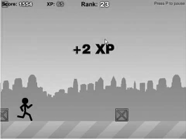
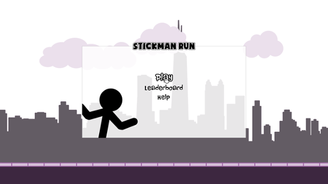
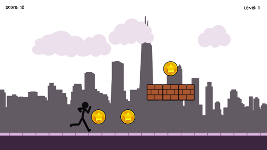
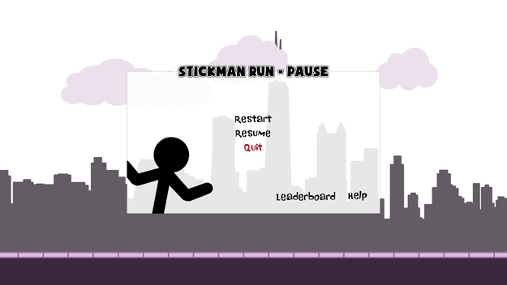
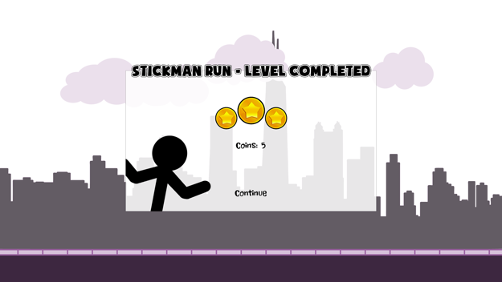
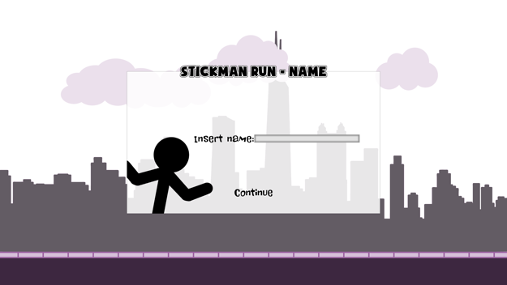
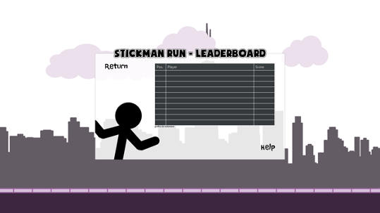
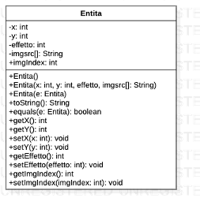
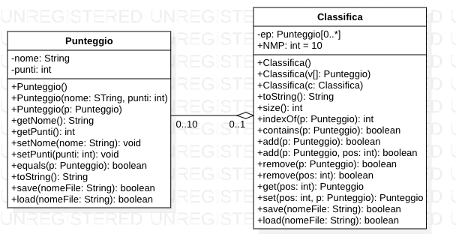
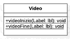

  <h1> STICKMAN RUN </h1>
<h2> <i>Bump Corporation</i> </h2>

### Pianificazione
#### Descrizione del funzionamento del gioco
Campo di gioco in cui Stickman si muove, correndo su una base per raggiungere delle monete che aggiungeranno punti, così come i metri percorsi. L’omino dovrà saltare degli ostacoli che compariranno e saranno in movimento insieme all’ambientazione.
Per quanto riguarda la classifica saranno disponibili i primi 10 punteggi (nome giocatore e punteggio).
Una moneta vale 5 punti, si guadagna un punto ad ogni metro trascorso. 
Si giocherà con la tastiera, il personaggio potrà saltare o abbassarsi (combinazione tasti W, S oppure frecce ↑, ↓). 
Viene mostrato nella zona in alto: punteggio corrente, record, nome del giocatore e il tasto pausa che aprirà un’altra finestra nella quale si deciderà se arrendersi (ESCI) oppure riprendere il gioco (RIPRENDI). Durante il gioco verrà visualizzato in automatico l’accumulo dei punti in centro schermo.

Possibili funzionalità aggiuntive:
* Livelli aggiuntivi
* Possibilità di superamento del livello soltanto con determinati requisiti (numero minimo di punti)
* Superpoteri (uccidere nemici, distruggere ostacoli)

Vincoli di sviluppo e di utilizzo
* linguaggio di programmazione Java
* ambiente di sviluppo IDE Eclipse
* librerie SWT (Standard Widget Toolkit)
* JDK e JRE 

### Analisi
#### Sintesi dei requisiti
Il gioco prevede nel dettaglio i seguenti componenti e la realizzazione dei seguenti aspetti:

1.	Video Introduttivo
Consiste in una veloce sequenza di immagini che formano un “video” che introduce il progetto e il gruppo.

2.	Avvio del gioco
 

Le operazioni da realizzare saranno:
-	Click sul bottone “Play” deve avviare il gioco
-	Click sul bottone “Help” apre una schermata di istruzioni di gioco
-	Click sul bottone “Leaderboard” apre la classifica 

3.	Fase di gioco
 
 

In questo caso i dati da gestire saranno:
-	Punteggio
-	Immagine dello StickMan
-	Immagine di Sfondo
-	Immagini degli Ostacoli
e le operazioni da realizzare saranno:
-	Spostamento immagini
-	Aumento Punteggio

4.	Schermata di pausa
 
 

Le operazioni da realizzare saranno:
-	Click sul bottone “Resume” riporta l’utente al gioco
-	Click sul bottone “Restart” permette all’utente di iniziare una nuova partita
-	Click sul bottone “Quit” chiude il gioco
-	Click sul bottone “Help” apre una schermata di istruzioni di gioco
-	Click sul bottone “Leaderboard” apre la classifica 

5.	Schermata di vittoria

 

In questo caso i dati da gestire saranno:
-	Totale monete raccolte 
-	nome giocatore
-	punteggio giocatore
e le operazioni da realizzare saranno:
-	Visualizzazione delle immagini delle monete in  funzione alle monete raccolte
-	Click sul bottone “Continue” porta a un’altra schermata
-	controllo dati input
-	salvataggio puntgeggio

6.	Visualizzazione della classifica 

In questo caso i dati da gestire saranno:
-	Nomi
-	Punteggi
-	Tabella
e le operazioni da realizzare saranno:
-	Visualizzazione dei dati
-	Click sul bottone “Return” riporta l’utente al gioco
-	Click sul bottone “Help” apre una schermata di istruzioni di gioco
-	Gestione tabella

7.	Video di chiusura del gioco
Consiste in una veloce sequenza di immagini che formano un “video” per la chiusura dell’applicazione.

#### Descrizione delle risorse hardware e software necessarie
Realizzazione del progetto
-	linguaggio di programmazione Java: programmazione 
-	ambiente di sviluppo IDE Eclipse: sviluppo dell’applicazione (parte algoritmica e gestione grafica)
-	librerie SWT (Standard Widget Toolkit): per la gestione della grafica in  linguaggio Java
-	JDK e JRE 
-	Photoshop: creazione grafiche di gioco

Utilizzo del gioco
-	JRE vesione 1.8.0_60
-	mouse
-	tastiera

### Progettazione
Tipi di variabili da usare e/o diagrammi UML delle classi da realizzare

